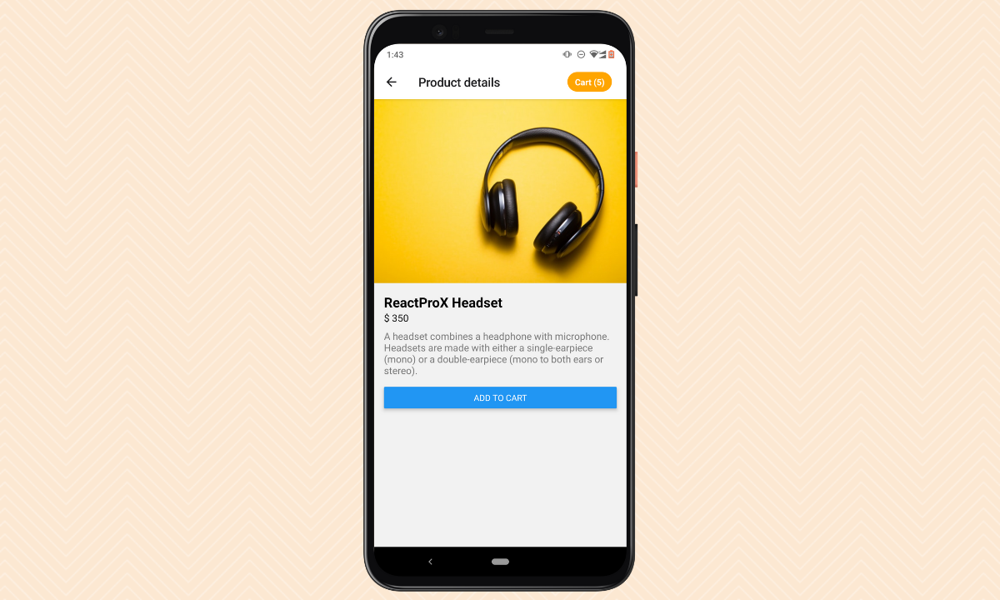
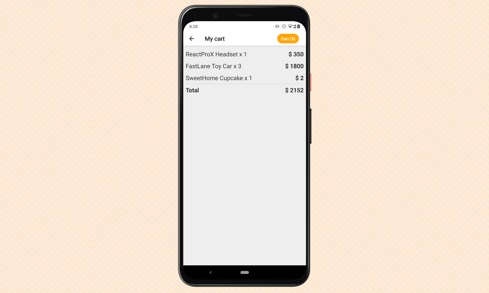

# react-native-ecommerce
A minimal React Native e-commerce app template.

This project provides a minimal starter project structure for your next awesome e-commerce app. 

- Screens: products list, details, and shopping cart summary.
- Simple state management with React Context API.
- Easy to extend with additional features.
- A mock API service for product data.
- Built with [Expo](https://expo.dev).

Check [this](https://blog.logrocket.com/build-ecommerce-app-from-scratch-with-react-native/) tutorial for guidance.

## Sample Screens

### Products List

### Product Details

### Shopping Cart Summary

## Credits

- Sample screens design: [MockUPPhone](https://mockuphone.com) and [Canva](https://www.canva.com).
- Product images: [Unsplash](https://unsplash.com/)

